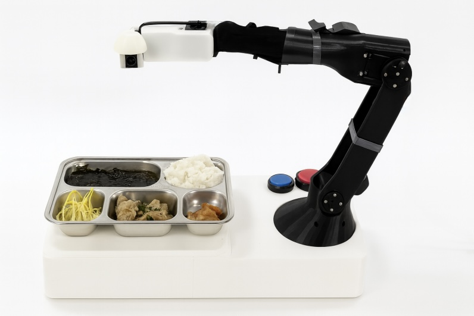

# 🦾 LUMEN: 3D프린팅 기술을 활용한 인체공학적 다관절 식사 보조 로봇팔
> **"누구나, 언제, 어디서나 스스로 식사할 수 있는 세상"**

인하대학교 **LUMEN(사람의 삶을 밝히는 기술)** 팀이 개발한 **3D프린팅 기반의 인체공학적 다관절 식사 보조 로봇팔** 프로젝트입니다. 상지 장애인, 노약자, 근골격계 환자 등 식사 자립이 어려운 분들의 독립적인 일상을 지원하며, AI 비전 인식 및 음성 제어 기술을 결합하여 저비용·경량·고정밀·안전성을 모두 만족하는 인간 중심 지능형 보조 로봇 시스템을 구현했습니다.

본 프로젝트는 **2025 창의적 종합설계 경진대회**에서 **장관상(2등)**을 수상하였습니다.

---

## 🏆 수상 실적
- **대회명**: 2025 캡스톤 디자인 및 창의아이디어 경진대회
- **상격**: **대상**
- **대회명**: 2025 인하 종합설계 경진대회 (인하공학교육혁신센터 주최/주관)
- **상격**: **인하대학교 총장상** 
- **대회명**: 2025 창의적 종합설계 경진대회 본선
- **상격**: **장관상(2등)**

---

## ✨ 핵심 특장점
- **정확성 (AI Vision)**: AI 카메라가 음식 종류와 입 위치를 실시간으로 인식하여 사용자 맞춤 최적 궤적을 생성합니다.
- **안전성 (Safety First)**: ISO 13850 국제표준 기반 비상정지 시스템과 전류센서 감지를 통해 이상 발생 시 0.1초 내로 전원을 긴급 차단합니다.
- **경량성 (Lightweight)**: 3D프린팅(PLA) 부품 설계로 전체 무게를 약 **1.5 kg** 이하로 구현하여 기존 금속 프레임 대비 약 60% 경량화 및 높은 휴대성을 확보했습니다.
- **경제성 (Cost-Effective)**: 제작 단가를 약 60~70% 절감하여 기존 고가의 해외 제품(1,000만 원 이상) 대비 압도적인 가격 경쟁력(400만 원 이하 공급 가능)을 가집니다.
- **확장성 (Smart Healthcare)**: 보호자용 앱을 통해 실시간 식사 영상을 모니터링하고 영양 및 식습관 데이터를 관리할 수 있습니다.

---

## ⚙️ 시스템 아키텍처 및 주요 기술

### 1. 하드웨어 & 인체공학 설계
- **다관절 구조 (6 DOF)**: 인체 팔의 움직임을 모사하여 숟가락의 궤적이 접시에서 입까지 자연스럽게 연결되도록 설계 (Inventor 및 NX 활용).
- **하이브리드 제어 인터페이스**: 사용자의 신체 조건에 맞춰 선택할 수 있는 3종 조작 방식(풋스위치, 손스위치, 마이크) 제공.
- **지속성**: 2주 이상 사용 가능한 고효율 배터리 탑재.

### 2. AI 비전 및 소프트웨어 시스템
- **음식 객체 인식**: `YOLOv8` 모델을 적용하여 식사 종류(국밥, 반찬, 죽 등)를 탐지하고 포크/스푼 모션을 자동 전환.
- **입 위치 추적 (Mouth Tracking)**: 실시간으로 사용자의 얼굴 및 입 좌표를 추적하여 정밀한 음식 전달 궤적 자동 계산.
- **음성 명령 인터페이스**: LLM 기반 음성명령 제어를 통해 손을 쓰지 않고도 원활한 식사 동작 수행 가능.

### 3. 제어 알고리즘
- **역기구학 (Inverse Kinematics)**: 다자유도 좌표 계산 및 회전각 제어 알고리즘 구현.
- **부드러운 궤적 생성**: Quadratic Programming 알고리즘을 활용하여 모터의 가속도를 최소화하고 흔들림 없는 안정적인 식사 동작 구현.
- **고정밀 제어**: FOC(Field-Oriented Control) 기반 모터 제어로 관절별 제어 정확도 `±0.5°` 이내 유지.

---

## 🛠️ 기술 스택 (Tech Stack)
- **Hardware**: Arduino, Raspberry Pi, Jetson Orin Nano, FOC Motor, Custom 3D Printed Parts (PLA)
- **Software & Control**: Python, C++, ROS (Robot Operating System)
- **AI & Vision**: YOLOv8, OpenCV, MediaPipe (Mouth Tracking), LLM (Voice Control)
- **3D Modeling**: Autodesk Inventor, Siemens NX

---

## 👥 팀원 및 역할 분담 (LUMEN)

| 성명 | 역할 | 담당 업무 |
| :--- | :--- | :--- |
| **조예은** | **PM** | 전체 총괄 |
| **전병철** | **하드웨어 제작** | 다관절 로봇팔 메커니즘 설계 및 하드웨어 통합 |
| **박원빈** | **제어 제작** | 임베디드 시스템 구축, 역기구학 및 모터 제어 알고리즘 구현 |
| **이상현** | **인공지능 제작** | YOLOv8 기반 음식 인식 및 입 위치 추적(Mouth Tracking) 모델 개발 |
| **김소희** | **제어 시스템 제작** | 전기회로 설계, 센서 연동 및 인터페이스 제어 보조 |
| **강수영** | **하드웨어 설계/제작** | Inventor/NX 활용 3D 모델링 및 3D 프린팅 부품 가공 |

---

## 📈 시장성 및 기대효과
- **B2B & B2C 시장 진출**: 요양병원, 재활시설 등 의료기관 납품(B2B)과 가정용 보조기기 판매(B2C) 구조 구축.
- **AI 헬스케어 연계**: 축적된 사용자의 식습관 및 영양 데이터를 활용하여 장기적인 맞춤형 디지털 헬스케어 서비스로 확장 가능.
- **사회적 가치**: 돌봄 인력 부족 문제 해결 및 사회적 약자의 자립적 환경 조성으로 인간 존엄성 회복 기여.

---

## 📚 참고문헌
1. 보건복지부(2024), "보건복지통계연보".
2. Ho-Chull Lee, Yong-Kwan Ji, & Jahng-Hyon Park(2019), "Geometric Analysis of Inverse Kinematics and Control for 7-DOF Robot Arm", 대한기계학회.
3. Minchang Sung & Youngjin Choi(2020), "Smooth Trajectory Generation Method Using Quadratic Programming", 한국로봇학회.
